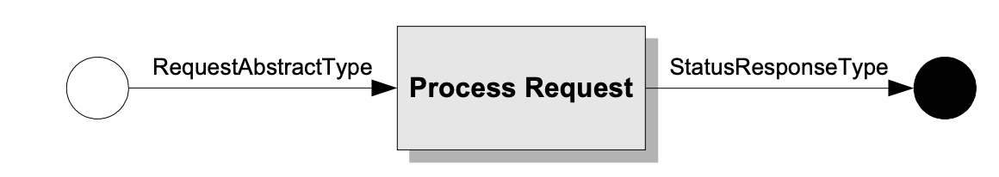

# 3 SAML协议

SAML协议消息可以使用各种协议来生成和交换。```SAML绑定规范[SAMLBind]```描述了一些使用现有的被广泛部署的传输协议来传输协议消息的具体方法。```SAML概要文件规范[SAMLProf]```描述了本节中定义的协议的许多应用，以及促进互操作性的附加处理规则、限制和要求。

特定的SAML请求和响应消息都是派生自公共类型。请求者发送一个派生自```RequestAbstractType```类型的元素给SAML响应者，响应者生成一个依附于```StatusResponseType```类型或从其派生出的元素，如图1所示。



在某些情况下，当概要文件允许时，可以在响应者没有收到相应请求的情况下生成和发送SAML响应。

被SAML定义的协议实现了下列的动作：

+ 返回一个或更多的请求断言。这可以发生在直接请求特定断言或者查询满足特定条件的断言时。

+ 根据请求执行身份验证并返回相应的断言。

+ 注册名称标识符或根据请求终止名称注册。

+ 获取一个通过artifact方法请求的协议消息。

+ 根据请求执行一系列相关会话（单个绘画）的几乎同时的注销。

+ 根据请求执行一个名称标识符的映射。

在本节中，```SAML协议命名空间```中的元素和类型的文本描述就不展示常规的名称空间前缀```samlp:```了。为清楚起见，```SAML断言命名空间```中的元素和类型的文本描述使用的常规命名空间前缀是```saml:```。


